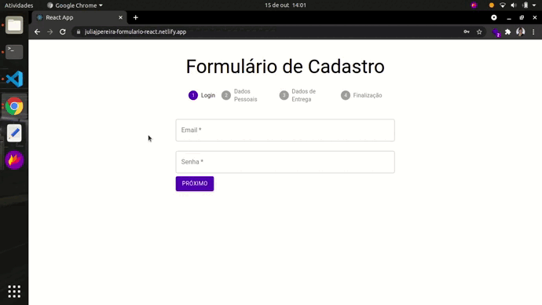

# Projeto Formulário React Material UI

Este projeto de estudo foi desenvolvido em **React**, com objetivo de aprender a usar Hooks, entender como trabalhar com Material Ul, criar Function Components e aprender a fazer validação de dados em formulários.

## Preview

- Para acessar o projeto, [cliquei aqui.](https://juliajpereira-formulario-react.netlify.app/)
